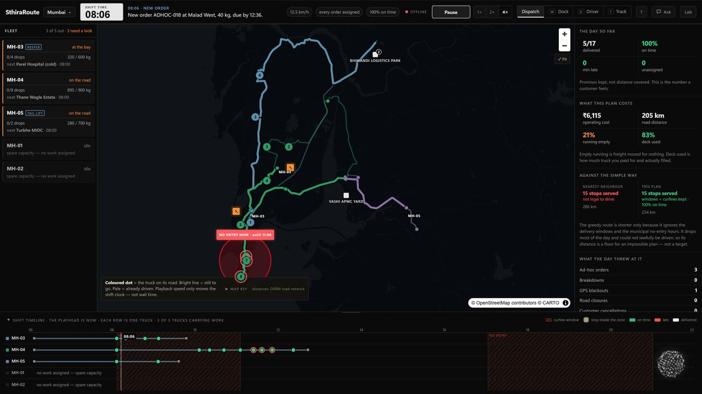
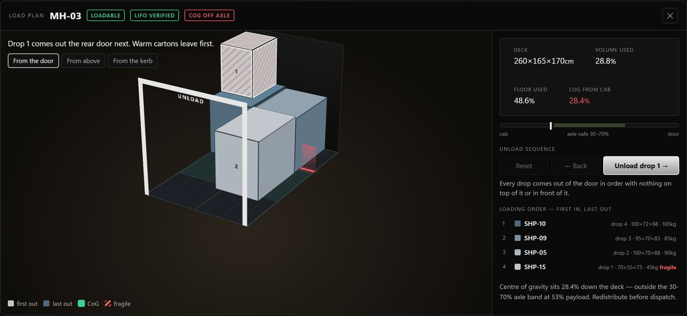
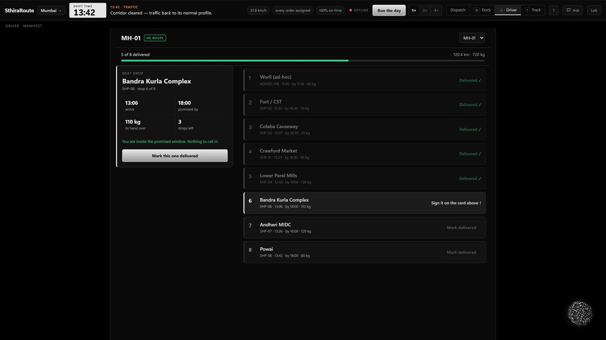
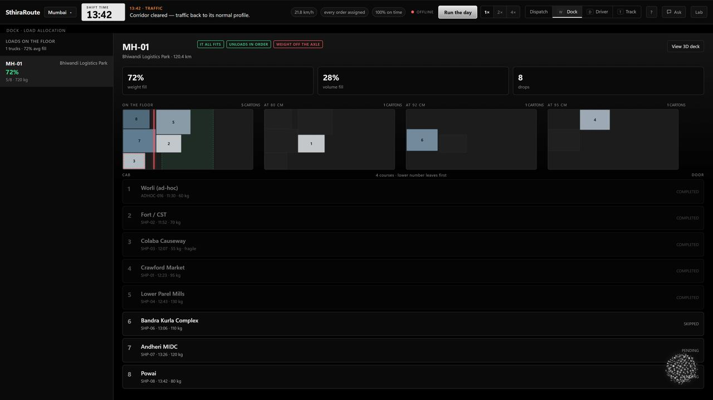
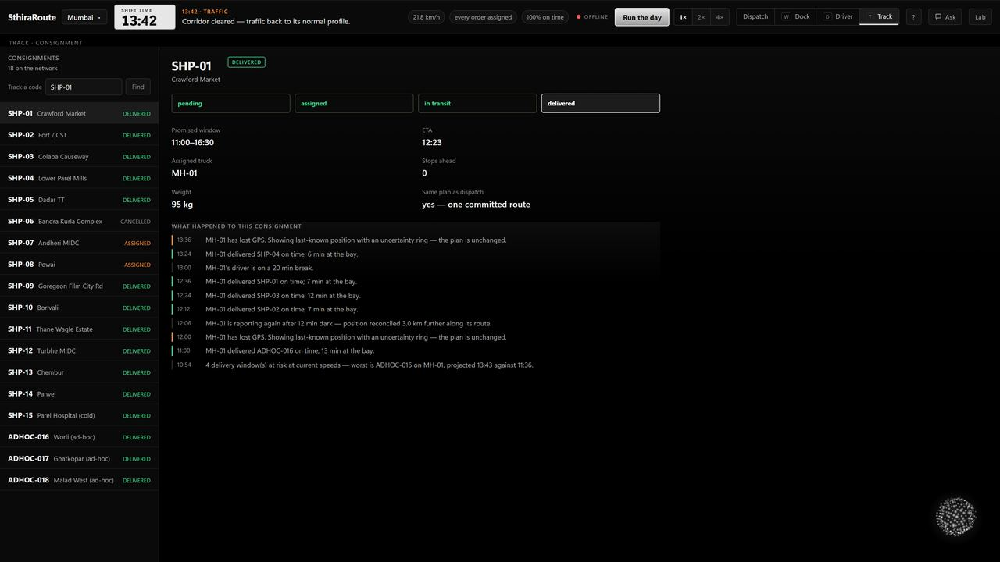
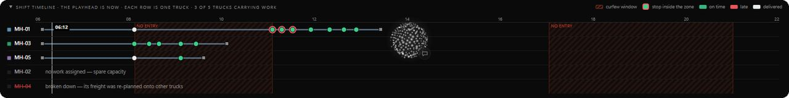
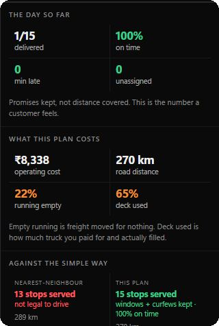

<p align="center">
  
</p>

<h1 align="center">SthiraRoute</h1>

<p align="center">
  <strong>Sthira (स्थिर) — steady.</strong><br />
  A fleet plan that survives the day.
</p>

<p align="center">
  <a href="https://rohensingh.in"></a>
  &nbsp;
  <a href="https://github.com/Blaxez/SthiraRoute"></a>
</p>

<p align="center">
  
  
  
  
</p>

---

## Why SthiraRoute

Indian city logistics is not a shortest-path demo. Trucks hit **municipal no-entry windows**, cold-chain freight needs the right vehicle, decks have **geometry**, and the day breaks — breakdowns, rush orders, GPS gaps.

SthiraRoute is a **dispatcher command board** that:

1. **Plans** a heterogeneous fleet with OR-Tools (CVRPTW + stability)
2. **Proves** each route physically fits with 3D LIFO load planning
3. **Keeps the plan alive** with live simulation, re-planning, and tracking desks

Measured on four city packs: **Bengaluru · Mumbai · Delhi NCR · Hyderabad** using real road distances (OSRM).

---

## Live demo

| | |
|---|---|
| **Production** | https://rohensingh.in |
| **Quick start** | Press **`P`** to prepare the shift · **Space** to run the day · **`?`** for shortcuts |
| **Desks** | Dispatch · Dock · Driver · Track |

> Prefer desktop for the full map + timeline board.

---

## Screenshots

### Dispatcher command board

Real-time map, fleet rail, KPIs, and shift timeline — with municipal no-entry overlays that bind on the clock.

<p align="center">
  
</p>

### 3D load plan (LIFO + axle check)

Every committed route gets a rotatable deck view: unload order, fragility, support, and centre-of-gravity band.

<p align="center">
  
</p>

### Driver desk

<p align="center">
  
</p>

### Dock desk

<p align="center">
  
</p>

### Track desk

<p align="center">
  
</p>

### Shift timeline

<p align="center">
  
</p>

### Cost / KPI ledger

<p align="center">
  
</p>

---

## What it solves (PS-02)

| Pain | SthiraRoute response |
|------|----------------------|
| Inefficient vehicle use | Heterogeneous fleet + fixed vehicle cost in the objective |
| Poor route planning | OR-Tools Guided Local Search on road matrices |
| No real-time visibility | Live map, WebSocket events, GPS / dead-reckon simulator |
| Fragmented stakeholders | Shared committed plan across Dispatch / Dock / Driver / Track |
| Illegal CBD slots | Time + geography no-entry zones the solver must wait out |
| “Fits by weight” lies | Post-solve 3D packer with LIFO audit |

---

## Architecture

```text
React + MapLibre  ──REST / WS──▶  FastAPI
                                    │
                    ┌───────────────┼───────────────┐
                    ▼               ▼               ▼
                 SQLite        OR-Tools         OSRM
              (Postgres-ready)  CVRPTW+GLS     road matrix
                                    │
                                    ▼
                              3D load packer
```

| Layer | Choice |
|-------|--------|
| API | FastAPI + Uvicorn |
| Optimiser | Google OR-Tools |
| Distances | OSRM (Haversine fallback) |
| UI | React · Vite · MapLibre GL |
| Deploy | nginx + systemd |

---

## Repository layout

```text
SthiraRoute/
├── apps/
│   ├── api/          # FastAPI · solver · sim · tracking
│   └── web/          # Dispatcher UI
├── deploy/           # nginx + systemd units
├── docs/
│   ├── brand/        # README logo
│   ├── screenshots/  # README gallery
│   └── HackShastraSIH.pdf
└── PPT/              # SIH presentation assets
```

---

## Run locally

### API — `http://127.0.0.1:8000`

```bash
cd apps/api
python -m venv .venv
# Windows: .venv\Scripts\activate
source .venv/bin/activate
pip install -r requirements.txt
cp .env.example .env
PYTHONPATH=. python scripts/seed.py --reset
PYTHONPATH=. uvicorn app.main:app --host 0.0.0.0 --port 8000
```

### Web — `http://127.0.0.1:5173`

```bash
cd apps/web
npm install
npm run dev
```

API docs: http://127.0.0.1:8000/docs

---

## Demo path (2 minutes)

1. Open the live site → city pack in the masthead  
2. **Prepare shift** (`P`) — plan, load, dispatch  
3. **Run day** (Space) — watch trucks follow road polylines  
4. Open a route **load plan** — walk LIFO unload  
5. **Lab** (`L`) — inject breakdown / new order / closure and re-plan  
6. Switch **Driver / Dock / Track** — same committed plan, three desks  

---

## Team

| | |
|---|---|
| **Team** | HackShastra |
| **Leader** | Santosh Maurya · `B25BS1530` |
| **Problem** | SIH 2026 · PS-02 · Smart Fleet Coordination and Logistics Management Platform |
| **Category** | Software · Transportation & Logistics |

---

## Links

- **Live MVP:** https://rohensingh.in  
- **Source:** https://github.com/Blaxez/SthiraRoute  
- **Presentation:** [docs/HackShastraSIH.pdf](docs/HackShastraSIH.pdf)  

---

<p align="center">
  <sub>Smart India Hackathon 2026 · HackShastra · SthiraRoute</sub>
</p>


